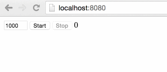

# react-interval

[](https://gitter.im/nkbt/help)

[](https://circleci.com/gh/nkbt/react-interval)
[](https://ci.appveyor.com/project/nkbt/react-interval)
[](https://codecov.io/github/nkbt/react-interval?branch=master)
[](https://david-dm.org/nkbt/react-interval)
[](https://david-dm.org/nkbt/react-interval#info=devDependencies)

Safe React wrapper for setInterval





## Installation

### NPM

```sh
npm install --save react react-interval
```

Don't forget to manually install peer dependencies (`react`) if you use npm@3.


### Bower:
```sh
bower install --save https://npmcdn.com/react-interval/bower.zip
```

or in `bower.json`

```json
{
  "dependencies": {
    "react-interval": "https://npmcdn.com/react-interval/bower.zip"
  }
}
```

then include as
```html
<script src="bower_components/react/react.js"></script>
<script src="bower_components/react-interval/build/react-interval.js"></script>
```


### 1998 Script Tag:
```html
<script src="https://npmcdn.com/react/dist/react.js"></script>
<script src="https://npmcdn.com/react-interval/build/react-interval.js"></script>
(Module exposed as `ReactInterval`)
```


## Demo

[http://nkbt.github.io/react-interval/example](http://nkbt.github.io/react-interval/example)

## Codepen demo

[http://codepen.io/nkbt/pen/ZGmpoO](http://codepen.io/nkbt/pen/ZGmpoO?editors=101)

## Usage

### Quicksart
Start counting on render

```js
import ReactInterval from 'react-interval';

const App = React.createClass({
  getInitialState() {
    return {count: 0};
  },

  render() {
    const {count} = this.state;

    return (
      <div>
        {count}
        <ReactInterval timeout={1000} enabled={true}
          callback={() => this.setState({count: this.state.count + 1})} />
      </div>
    );
  }
});
```

### Full example
Chang timeout on the fly, start and stop counting

```js
import React from 'react';
import ReactDOM from 'react-dom';
import ReactInterval from 'react-interval';

const App = React.createClass({
  getInitialState() {
    return {
      enabled: false,
      timeout: 1000,
      count: 0
    };
  },

  render() {
    const {timeout, enabled, count} = this.state;

    return (
      <div>
        <ReactInterval {...{timeout, enabled}}
          callback={() => this.setState({count: this.state.count + 1})} />

        <input type="number" step="200" min="200" max="5000" value={this.state.timeout}
          onChange={({target: {value}}) => this.setState({timeout: parseInt(value, 10)})} />&nbsp;

        <button disabled={enabled} onClick={() => this.setState({enabled: true})}>
          Start</button>&nbsp;

        <button disabled={!enabled} onClick={() => this.setState({enabled: false})}>
          Stop</button>&nbsp;

        {count}
      </div>
    );
  }
});

const appRoot = document.createElement('div');
document.body.appendChild(appRoot);
ReactDOM.render(<App />, appRoot);
```

## Options


#### `callback`: PropTypes.func.isRequired

Function repeatedly called after timeout


#### `enabled`: PropTypes.bool (default: false)

Should start timer?


#### `timeout`: PropTypes.number (default: 1000)

Timeout before each `callback` call


## Development and testing

Currently is being developed and tested with the latest stable `Node 5` on `OSX` and `Windows`.
Should be ok with Node 4, but not guaranteed.

To run example covering all `ReactInterval` features, use `npm start`, which will compile `src/example/Example.js`

```bash
git clone git@github.com:nkbt/react-interval.git
cd react-interval
npm install
npm start

# then
open http://localhost:8080
```

## Tests

```bash
npm test

# to run tests in watch mode for development
npm run test:dev

# to generate test coverage (./reports/coverage)
npm run test:cov
```

## License

MIT

